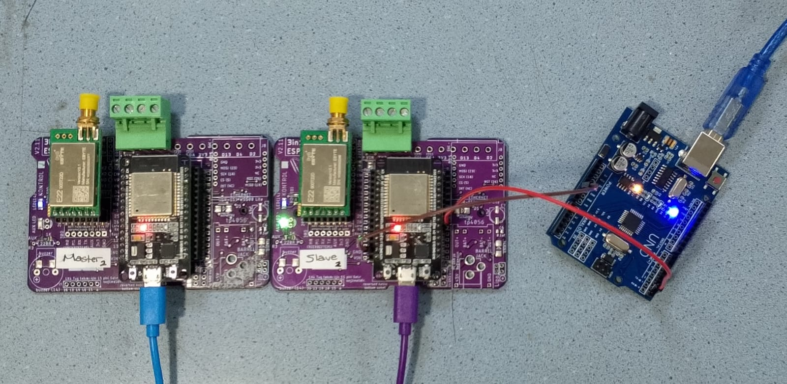

## `LoRa AGV Monitor`

<br>

<div align="center">

</div>

---

<br>

##### ⚙️ WiFi and MQTT Settings

> master2/master2.ino

```ino
const char* WiFi_SSID = "<WIFI_NAME>";
const char* WiFi_PASS = "<WIFI_PASSWORD>";
const char* MQTT_SERVER = "<MQTT_SERVER_IP>";
```

---

<br>

##### ⚙️ Pinout

> uart device -> slave2

```txt
tx -> rx2
gnd -> gnd
```

---

<br>

- UART Device Data

```txt
t:36|l:1|la:50.00|c:1|br:1|bt:58
```

- Send Data MQTT Broker

```json
{"t":36.00,"l":1,"la":50.00,"c":1,"br":1,"bt":31.00}
```
